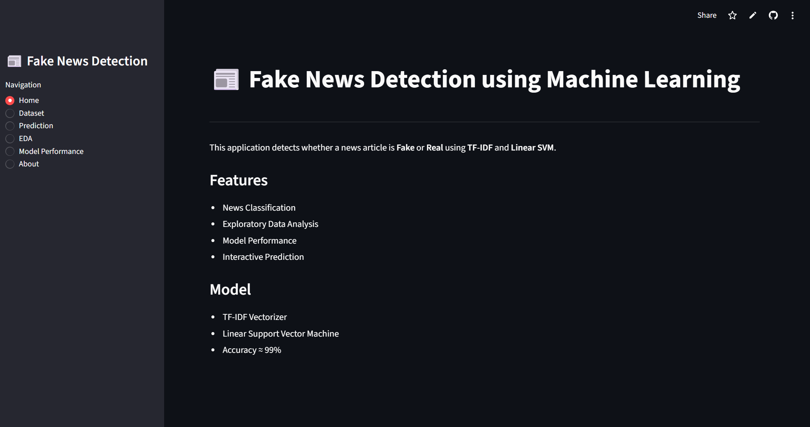
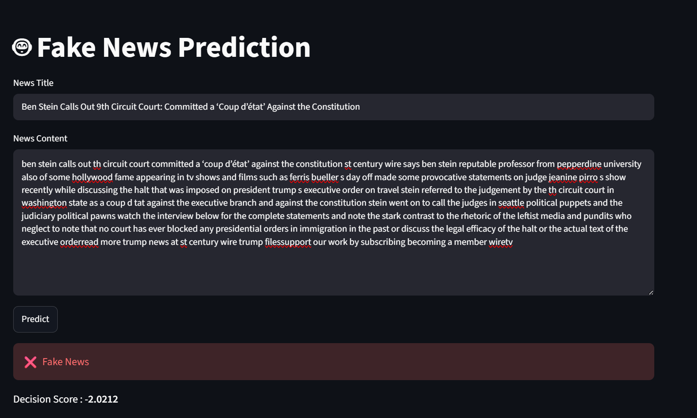
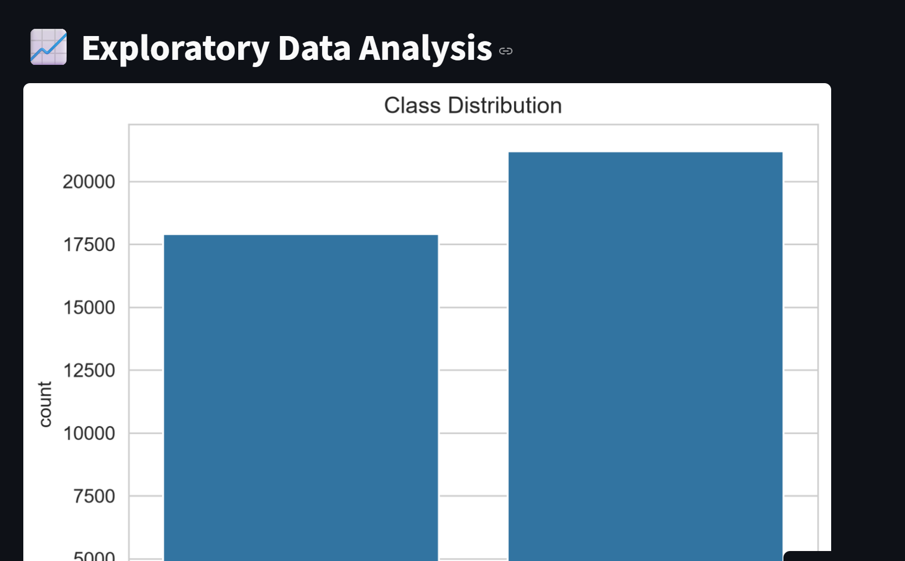

# 📰 Fake News Detection using Machine Learning


---

This project is an **End-to-End Machine Learning and Natural Language Processing (NLP)** application that classifies news articles as **Fake News** or **Real News** using **TF-IDF Vectorization** and a **Linear Support Vector Machine (SVM)** classifier.

---

## 📊 Model Performance

- ✅ Accuracy: **99%**
- 🎯 Precision: **99%**
- 📈 Recall: **99%**
- ⭐ F1-Score: **99%**

---

## 🚀 Live Demo

[](https://fakerealnewsdetection-efy8jiwjxqvmm9ujea4zuc.streamlit.app/)

---

## 📸 Screenshots

<p align="center">
  
  
  
</p>

---

## ✨ Features

- 📰 Detects whether a news article is **Fake** or **Real**
- 📊 Interactive Streamlit Web Application
- 🧹 Automatic Text Preprocessing
- 📈 Exploratory Data Analysis (EDA)
- 🤖 TF-IDF Feature Extraction
- 🎯 Linear SVM Classification
- 📉 Confusion Matrix, ROC Curve and Precision-Recall Curve
- ⚡ Fast Predictions with Decision Score

---

## 🛠️ Tech Stack

- Python 🐍
- Streamlit
- Scikit-learn
- Pandas
- NumPy
- Matplotlib
- WordCloud
- NLTK
- 
---

## 📂 Dataset

This project uses the **Fake and Real News Dataset** from Kaggle.

## 📂 Dataset

This project uses the **Fake and Real News Dataset** from Kaggle.

[](https://www.kaggle.com/datasets/clmentbisaillon/fake-and-real-news-dataset)

The dataset contains:

- 📰 **23,481 Fake News Articles**
- 📰 **21,417 Real News Articles**
- 📄 **44,898 Total Articles**

> **Note:** The dataset is not included in this repository due to GitHub file size limitations. Please download it from Kaggle before running the project. :contentReference[oaicite:0]{index=0}
---

## ⚙️ Workflow

1. Data Collection
2. Data Preprocessing
3. Exploratory Data Analysis
4. Train-Test Split
5. TF-IDF Feature Extraction
6. Model Training using Linear SVM
7. Model Evaluation
8. Fake News Prediction
9. Streamlit Deployment

---

## 📈 Evaluation Metrics

- Accuracy
- Precision
- Recall
- F1-Score
- Classification Report
- Confusion Matrix
- ROC Curve
- Precision-Recall Curve

---

## ▶️ Installation

Clone the repository

```bash
git clone https://github.com/your-username/Fake_Real_News_Detection.git
```

Move into the project folder

```bash
cd Fake_Real_News_Detection
```

Install dependencies

```bash
pip install -r requirements.txt
```

Run the application

```bash
streamlit run app.py
```

---

## 🎯 Future Improvements

- Deep Learning using LSTM
- BERT-based Fake News Detection
- Multilingual News Classification
- News URL Classification
- Explainable AI (SHAP/LIME)
- Confidence Probability Visualization

---

## ⚠️ Disclaimer

This project is intended for **educational and research purposes only**.

Predictions are generated using a machine learning model and should **not** be considered a substitute for professional fact-checking or verification from trusted news sources.

---

## 👨‍💻 Author

**Om Jee**

Machine Learning & Data Science Enthusiast

⭐ If you found this project helpful, consider giving it a **Star** on GitHub!
